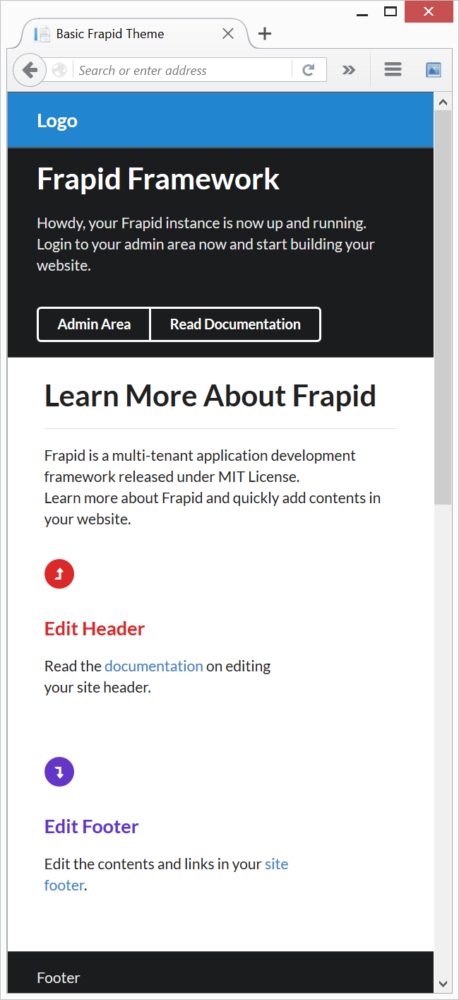

# Creating a Website Theme

Frapid supports multiple themes per tenant. For foo.com domain, the themes directory is:

`~/Catalogs/foo_com/Areas/Frapid.WebsiteBuilder/Themes/<ThemeName>`

Once a theme is uploaded to the themes directory, frapid will automatically discover it.

## Theme Components:

| Component | File | Description |
| --- | --- | --- |
| Theme Configuration File | Theme.config | Contains theme information and configuration. |
| Homepage Layout File | Layout-Home.cshtml | Homepage layout file. |
| Default Layout File | Layout.cshtml | Layout for site pages. |
| Theme Header | Header.cshtml | Site header |
| Theme Footer | Footer.cshtml | Site footer |
| 404 Document | 404.cshtml | 404 document |
| Theme Preview Image | Preview.png | Screenshot of the theme. |

These file names are mandatory:

* Theme.config
* Preview.png
* 404.cshtml

## Theme.config Example

```xml
<?xml version="1.0"?>
<configuration>
  <appSettings>
    <add key="Author" value="Frapid" />
    <add key="AuthorUrl" value="http://frapid.com" />
    <add key="AuthorEmail" value="info@frapid.com" />
    <add key="ConvertedBy" value="N/A" />
    <add key="ReleasedOn" value="16 December 2015" />
    <add key="Version" value="1.0" />
    <add key="Category" value="Corporate &amp; Business" />
    <add key="Responsive" value="Yes" />
    <add key="Framework" value="Semantic UI" />
    <add key="Tags" value="business, corporate" />
    <add key="HomepageLayout" value="Layout-Home.cshtml" />
    <add key="DefaultLayout" value="Layout.cshtml" />
  </appSettings>
</configuration>
```

## Quickstart Guide

Let's build a very basic theme using [Semantic UI](http://semantic-ui.com/).

### Basic Layout

* Create a directory named `example` on `~/Catalogs/<YourTenant>/Areas/Frapid.WebsiteBuilder/Themes`.
* Create an empty file called "Layout.cshtml" and Theme.config.
* Paste the following contents.

**Layout.cshtml contents**
```html
<!DOCTYPE html>
<html lang="en">
  <head>
    <meta charset="utf-8">
    <meta http-equiv="X-UA-Compatible" content="IE=edge">
    <meta name="viewport" content="width=device-width, initial-scale=1">
    <title>Basic Frapid Theme</title>
    <link href="https://cdnjs.cloudflare.com/ajax/libs/semantic-ui/2.1.7/semantic.min.css" rel="stylesheet">
  </head>
  <body>
    <section id="header" class="ui attached inverted blue segment">
        <div class="ui container">
            <a class="ui inverted header" href="/">Logo</a>
        </div>
    </section>
    <section id="body" style="height:calc(100% - 92px);">
        @RenderBody()
    </section>
    <section id="footer" class="ui inverted attached segment">
        <div class="ui container">
            Footer
        </div>
    </section>
    @Html.AntiForgeryToken()
    <script src="https://ajax.googleapis.com/ajax/libs/jquery/1.11.3/jquery.min.js"></script>
    <script src="https://cdnjs.cloudflare.com/ajax/libs/semantic-ui/2.1.7/semantic.min.js"></script>
  </body>
</html>
```

**Theme.config contents**

```xml
<?xml version="1.0"?>
<configuration>
  <appSettings>
    <add key="Author" value="Frapid" />
    <add key="AuthorUrl" value="http://frapid.com" />
    <add key="AuthorEmail" value="info@frapid.com" />
    <add key="ConvertedBy" value="N/A" />
    <add key="ReleasedOn" value="16 December 2015" />
    <add key="Version" value="1.0" />
    <add key="Category" value="Corporate &amp; Business" />
    <add key="Responsive" value="Yes" />
    <add key="Framework" value="Semantic UI" />
    <add key="Tags" value="business, corporate" />
    <add key="HomepageLayout" value="Layout.cshtml" />
    <add key="DefaultLayout" value="Layout.cshtml" />
  </appSettings>
</configuration>
```
### Edit Configuration File

Edit the configuration file `~/Catalogs/<YourTenant>/Areas/Frapid.WebsiteBuilder/WebsiteBuilder.config`
and set `DefaultTheme` to `example`.

### Preview the site



Congratulations, you have successfully built a theme for frapid.

### Advanced Tutorials
* [Multiple Layouts](multiple-layouts.md)
* [Layout Sections](layout-sections.md)
* [Displaying Menus from Database](menus.md)
