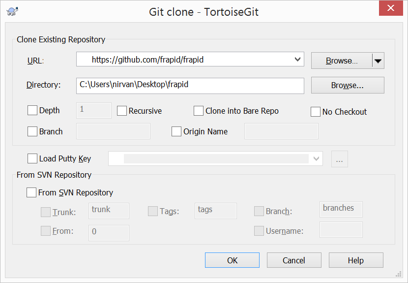

# Installing Frapid

Before you begin reading this document, throw your pillows off and get these tools installed on your PC first:

* [Visual Studio 2015 Community](http://visualstudio.com)
* [PostgreSQL Server 9.3 or above](http://postgresql.org)
* [Git for Windows](http://git-scm.com)
* [TortoiseGit (if you want a nice Git GUI)](https://tortoisegit.org/download/)

Once you have all of the above, you're good to go.

## Learn to Use Git

**Please do not download github repository as a ZIP file**.
Use git to clone frapid.

**Using Git (Optional)**

Run Git Bash console application.

```git
mkdir frapid
cd frapid
git clone https://github.com/frapid/frapid

```

**OR**

**Tortoise Git (Optional)**

* Using Windows Explorer, navigate to the directory where you want to keep frapid source codes on.
* Right mouse click and then click **Git Clone**.
* On the URL field, type `https://github.com/frapid/frapid`.
* Click OK.



Once you finish this step, you have a local frapid git repository on your hard drive.


## Convention and Configuration over Convention or Configuration

Configuration enables you to customize application behaviors whereas convention 
forces you to follow and keep track of things. Frapid uses best of both worlds.

### Master Configuration

The root directory of frapid web application is:

`~/src/Frapid.Web`

The master configuration files are available on the `~/Resources/Configs` directory.

|File Name                                | Description              |
|-----------------------------------------|--------------------------|
| [DbServer.config](../configs/DbServer.config.md)   | Contains configuration realted your PostgreSQL server. |
| [DomainsApproved.json](../configs/DomainsApproved.json.md) | Contains list of approved DNS domain names which will be served by Frapid. |
| [DomainsInstalled.json](../configs/DomainsInstalled.json.md) | Contains list of installed DNS domain names. This file should not be edited manually. |
| [JwtConfig.json](../configs/JwtConfig.json.md) | Contains configuration related to Json Web Tokens. |
| [Parameters.config](../configs/Parameters.config.md) | Contains standard application configuration data.|


**You must be fairly familiar with the master configuration files before you proceed to the next steps.**


### Instance Configuration (Convention)

Configuration in frapid is instance-aware. It is, therefore, safe to assume that configuration of **foo.com**
does not affect **bar.com**.

[By convention](../concepts/database-naming-convention.md), the configuration files for **foo.com** would be located on:

`~/Catalogs/foo_com/Configs`

#### Instance Directories

|File Name                                | Description              |
|-----------------------------------------|--------------------------|
| Areas | Contains module specific configuration and [overrides](../developer/overrides.md) for `foo_com` instance. |
| Attachments | Attachments (uploads) of `foo_com` instance. |
| Backups | Backups of `foo_com` instance | 
| Configs | Configuration files related to `foo_com` instance. More on this topic is discussed below. |
| Documents | Documents related to `foo_com` instance. |

### Instance-Specific Application Configuration Files

|File Name                                | Description              |
|-----------------------------------------|--------------------------|
| [Applications.config](../configs/Applications.config.md) | Contains configuration of frapid applications related to `foo_com` instance. |
| [SMTP\SendGrid.json](../configs/SendGrid.json.md) | Contains configuration of [SendGrid Transactional Email Service](http://sendgrid.com) related to `foo_com` instance.
| [SMTP\Mailgun.json](../configs/Mailgun.json.md) | Contains configuration of [Mailgun Transactional Email Service](http://mailgun.com) related to `foo_com` instance.


### Website Themes

By convention, website themes would be found on:

`~/Catalogs/foo_com/Areas/Frapid.WebsiteBuilder/Themes/<ThemeName>`

Read more on the chapter [Creating Website Themes](../developer/website-builder/theme.md).

## Create IIS Application

Now that you have gone through this document completely, 
you now have a proper understanding of what's going under the hoods.

Please follow the [IIS Installation Guide](iis.md) to install frapid on your development machine.

[Return Back](../../README.md)
